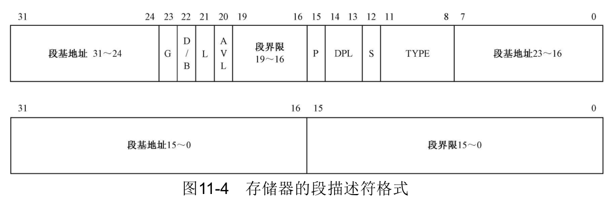
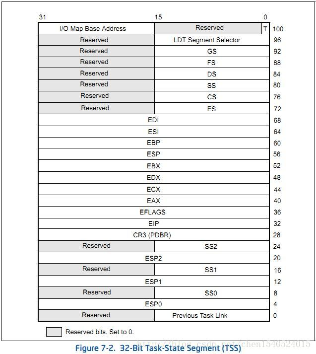

# 硬件端口
### 1. 60h-64h
##### Intel 8042 Keyboard/Auxiliary Device Controller
##### 英特尔键盘/辅助设备控制器
a. A20GATE
键盘控制器8042在接收到命令后将它的P21引脚（输出端口P2）置高电平。此时处理器将A20地址线和键盘控制器的这个输出端口的进行AND操作，进而控制A20地址线的打开和关闭。键盘控制器的这个引脚因此得名A20Gate

CPU通过IO端口直接与这个芯片进行通信，对应的IO端口为0x60。但向该端口写入数据的方法比较复杂，0x60是一个只读端口，不能使用IN/OUT指令直接操作0x60端口，需要涉及0x64端口。其中，0x60端口的位1用于影响A20。60h端口状态只能在64h端口状态0位=1时读取。
具体查看连接<http://www.os2site.com/sw/info/memory/ports.txt>

64h READ
| BIT | 功能 |
|:----:|:----:|
|7		|1=奇偶校验错误|
|6		|1=超时|
|5		|1=辅助输出缓冲已满|
|4		|1=约束交换|
|3		|1=指令/数据|
|2		|1=系统标志位|
|1		|1=输入缓冲已满|
|0		|1=输出缓冲已满|
### 2. 92h
##### ALT_A20_GATE
除了端口号0x60可以影响A20寻址，端口0x92也用于A20寻址，被称作“替代的A20门控制”
其中，0x92端口的位0用于计算机重启，位1用于影响A20地址线。与0x60不同，0x92可以直接使用IN/OUT指令进行修改，方便快捷，因此也被称作Fast A20。0x60和0x92的位1进行或运算后连接到A20M#引脚，用于控制A20地址线的开启和关闭
### 3. 20h-21h主8259A中断控制芯片
用来控制中断处理，置1则CPU忽略该中断的处理。具体每一位对应中断如下图所示：</br>
<image src="./pictures/int8259.png"/>
# BIOS功能
### VESA/VBS
+ 对所有vesa方法，如果支持某个vesa方法返回al = 0x4f，ah作为状态标志。成功时ah = 0x00。
+ INT 0X10 AX = 0X4F00 ES:DI = RESUSLT
  获得控制信息，返回所有支持的画面模式
  ```c
   struct VbeInfoBlock {               //total 512B  
      char     VbeSignature[4];        // == "VESA"
      uint16_t VbeVersion;             //版本 == 0x0300 for VBE 3.0
      uint16_t OemStringPtr[2];        // segment:offset 指针指向OEM(原始设备制造商)字符串
      uint8_t  Capabilities[4];        // 显卡能力？
      uint16_t VideoModePtr[2];        // segment:offset 指针指向支持的显示模式 结尾会以0xffff结束
      uint16_t TotalMemory;            // 64K显存数据块个数
      uint16_t software_rev;           // 软件版本号
      uint32_t vendor;                 // segment:offset 指针指向显卡厂商字符串
      uint32_t product_name;           // segment:offset 指向显卡型号名称字符串
      uint32_t product_rev;            // segment:offset 指向产品版本字符串
      uint8_t  Reserved[478];
   }
  ```
+ INT 0X10 AX = 0X4F01 CX = MODE ,ES:DI = RESUSLT
  获得对应模式信息。返回256B在es:di地址
  ```c
      struct vbe_mode_info_structure {
         uint16_t attributes;		// 0x00 弃用，是否支持线性帧缓冲器
         uint8_t window_a;			// 0x02 弃用
         uint8_t window_b;			// 0x03 弃用
         uint16_t granularity;	// 0x04 弃用
         uint16_t window_size;   // 0x06 窗口大小
         uint16_t segment_a;     // 0x08 
         uint16_t segment_b;     // 0x0a
         uint32_t win_func_ptr;	// 0x0c 弃用 
         uint16_t pitch;			// 0x10 每个水平线？的字节数
         uint16_t width;			// 0x12 x分辨率
         uint16_t height;			// 0x14 y分辨率
         uint8_t w_char;			// 0x16 未使用
         uint8_t y_char;			// 0x17 ...
         uint8_t planes;         // 0x18 平面？
         uint8_t bpp;			   // 0x19 每个像素的字节数（色数）必须为8
         uint8_t banks;			   // 0x1a 弃用
         uint8_t memory_model;   // 0x1b 存储模式(颜色存贮方式，必须为4调色板法)
         uint8_t bank_size;		// 0x1c 弃用
         uint8_t image_pages;    // 0x1d ?
         uint8_t reserved0;      // 0x1e 
      
         uint8_t red_mask;       // 0x1f
         uint8_t red_position;   // 0x20
         uint8_t green_mask;
         uint8_t green_position;
         uint8_t blue_mask;
         uint8_t blue_position;
         uint8_t reserved_mask;
         uint8_t reserved_position;
         uint8_t direct_color_attributes; //0x27
      
         uint32_t framebuffer;		// 0x28 vram的物理地址
         uint32_t off_screen_mem_off;
         uint16_t off_screen_mem_size;	
         uint8_t reserved1[206];
   }
   ```
+ INT 0x10, AX=0x4F02, BX=mode, ES:DI=CRTCInfoBlock
  设置画面模式，如果要使用的模式使用了线性帧缓冲器需要将mode or 0x4000 
  可以在保护模式下执行，但是可能会重置gdt。
# 要点信息
 
### 在实模式下，处理器的寻址仅涉及CS和IP两个寄存器，即CS<<4+IP，对应的线性地址为0h-10ffefh。当A20地址线处于关闭状态时，A20强制置0，此时实际寻址范围为0h-fffffh。但当A20处于打开状态，A20可以接受来自A19的进位，此时实际寻址范围为0h-10ffefh

### 1. GDT表项全局描述符表格式：(大端序要反转)
   
   <https://blog.csdn.net/qq_43098197/article/details/127161848>

   IDT表项中断门、调用门、陷阱门
   <https://zhuanlan.zhihu.com/p/400007642>
   
   GDT任务门(tss描述符)(32位tss段)
   <https://blog.csdn.net/chen1540524015/article/details/74075252>

### 2. 在保护模式下，CS寄存器不能直接通过MOV指令进行操作。
   在保护模式下，要修改CS寄存器的值，需要使用特殊的指令，如LJMP（长跳转）或LRET（长返回）。这些指令会将新的代码段选择子加载到CS寄存器中，并跳转到指定的地址。

### 3. 在保护模式下，处理器寻址是基于段选择子和段描述符，段描述符中段基地址32bit，段限长20bit，理论最大寻址范围为0h-1000fffefh。当A20地址线处于关闭状态时，经过计算的地址的第21位被强制置0，导致处理器无法寻址MB为奇数的任何线性地址。例如，对于0x000100ab，将会被强制转换为0x000000ab。需要注意的是，该操作影响寻址的原理是影响线性地址，而不是影响虚拟地址。当然，A20处于打开状态，就没有任何影响了
   
### 4. 在设定完全局描述符表、打开32位后，cpu仍然是运行16位指令，需要一个长跳转ljmp重新指定cs和ip才会真正进入32位模式。在此之前可以使用32位地址，但是指令格式仍然是16位。要注意bits 32和bits 16的区别和使用
   
### 5. 在16位指令模式下，前缀追加66\67的指令会被执行为32位指令，反之32位模式下，有前缀的会被执行为16位指令
   
### 6. C语言里规定：16bit程序中，返回值保存在ax寄存器中，32bit程序中，返回值保持在eax寄存器中，如果是64bit返回值，edx寄存器保存高32bit，eax寄存器保存低32bit。

### 7. 任务状态段基本格式
   
   T标志（调试陷阱，100字节，位0）—如果设置，当切换任务时，会引起调试异常。
   在TSS偏移102字节处有一个单字被称为“I/O位图基址”（它的值定义为当前地址-TSS基址+2），指向的便是I/O许可位图，之所以称之为位图，是因为它的每一位表示一个字节的端口地址是否可用。如果某一位为0，则表示此位对应的端口号可用，为1则不可用。每一个任务都可以有单独的TSS，故每一个任务可以有它单独的I/O许可位图。I/O许可位图必须以0FFh结尾。如果I/O位图基址大于或等于TSS段界限，就表示没有I/O许可位图，如果CPL>=IOPL（IO特权级，位于寄存器eflags的第13位），则所有I/O指令都会引起异常。I/O许可位图的使用使得即便在同一特权级下不同的任务也可以有不同的I/O访问权限。
   
### 8. 系统关键寄存器详解
   <https://blog.csdn.net/Gyc8787/article/details/121779971>
关于I/O许可位图用法，可见下例：
```masm
[SECTION.TSS]

LABEL_TSS:
                      ......
                      DD SelectorLDT                                     ;LDT选择子
                      DW 0                                                         ;调试陷阱位标志
                      DW $ - LABEL_TSS  + 2                        ;指向I/O许可位图
          times 12 DB 0FFh                                              ;端口00h - 5fh
                      DB 11111101b                                       ;端口60h - 67h,只允许端口61h的操作
                      DB 0ffh                                                     ;I/O许可位图结束标志
TSS_Len                   EQU                       $ - LABEL_TSS
```
### 9.Linux系统中的进程主要有以下六种状态。
（1）TASK_RUNNING（可运行状态）。正在运行的进程或在可运行进程队列（run_queue）中等待运行的进程处于该状态。它实际上包含一般操作系统原理教材中所谓进程三种基本状态中的运行态和就绪两种状态。
当CPU空闲时，进程调度程序只在处于该状态的进程中选择优先级最高的进程运行。Linux中运行态的进程可以进一步细分为3种：内核运行态、用户运行态和就绪态。

（2）TASK_INTERRUPTIBLE（可中断阻塞状态）。处于可中断阻塞状态的进程排成一个可中断阻塞状态进程队列，该队列中的阻塞进程在资源有效时，能被信号或中断唤醒进入到运行态队列。

（3）TASK_UNINTERRUPTIBLE（不可中断阻塞状态）。不可中断指的是进程不响应信号。处于不可中断阻塞状态的进程排成一个不可中断阻塞状态进程队列。该队列中的阻塞进程，不可被其他进程唤醒，只有被使用wake_up()函数明确唤醒时才能转换到可运行的就绪状态。

（4）TASK_STOP/TASK_TRACED（暂停状态）。当进程收到信号SIGSTOP、SIGTSTP、SIGTTIN或SIGTTOU时就会进入暂停状态。可向其发送SIGCONT信号，让进程转换到可运行状态。

（5）TASK_DEAD-EXIT_ZOMBIE（僵死状态）。表示进程停止但尚未消亡的一种状态。此时进程已经结束运行并释放掉大部分资源，但父进程尚未收回其PCB。在进程退出时，将状态设为TASK_ZOMBIE，然后发送信号给父进程，由父进程再统计其中的一些数据后，释放它的task_struct结构。处于该状态的进程已经终止运行，但是父进程还没有询问其状态。

（6）TASK_DEAD-EXIT_DEAD（退出状态），处于此状态的进程即将被销毁，EXIT_ DEAD非常短暂，几乎不可能通过ps命令捕捉到。

# 部分指令机器码
+ | 操作码 | 指令 | 说明 |
  |:-----:|:-----:|:----|
  |0f 01/2|LGDT m16&32||
  |0f 01/3|LIDT m16&32||

# Tips
+ 对于nasm来说最好将数据段放在最后，不然会被当成代码段
+ 在没打开32位时只能使用16位（默认）编译，打开32位后的32位指令只能使用32位（bits 32）编译

# 实验记录
### 2023.10.30
目前来看多任务的切换代价可接受（略低于0.2B/10s）但关闭任务切换性能计数器从 0.6B下降到0.2B，难以理解。
初步判断可能原因：
1、修改后多次重复执行的load_eflags,store_eflag函数执行包括跳转严重影响性能
2、int20时钟中断的处理影响性能（感觉可能性较低）

之后实现缓冲区休眠后可以继续测试验证猜测1

### 2023.12.20
实现重做多任务后性能一下上升了很多，可以达到惊人的1.4B/10s，所以针对上面性能下降的猜测可能是因为循环中检查缓冲区严重稀释了累加器的计算效率。
但是由于主任务只进行累加器计算，会出现全局变量time_count清零失败的情况。问题出在while(1) time_count++的运行太快了，切换任务时可能正好加法运算还没有做完。清零之后再做剩下的加法存到内存就变成了没有清零的效果。使用信号量可以解决问题，但是性能下降十分严重，变成了仅有0.2M/10s，绝对无法接受。直接关中断解决性能可以达到0.7B/10s